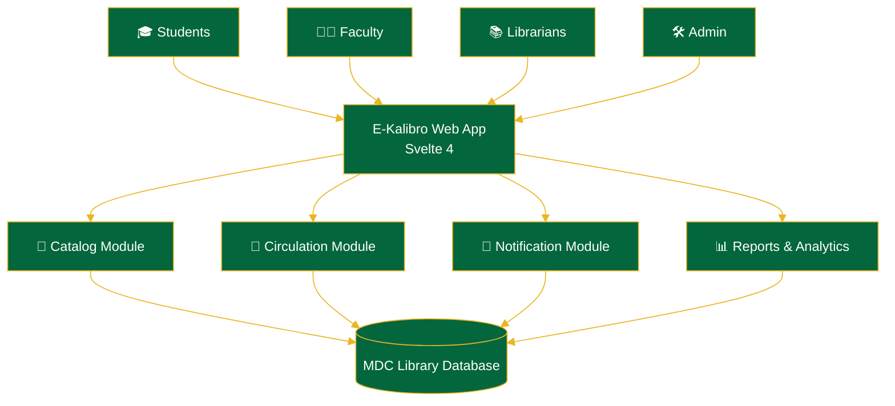
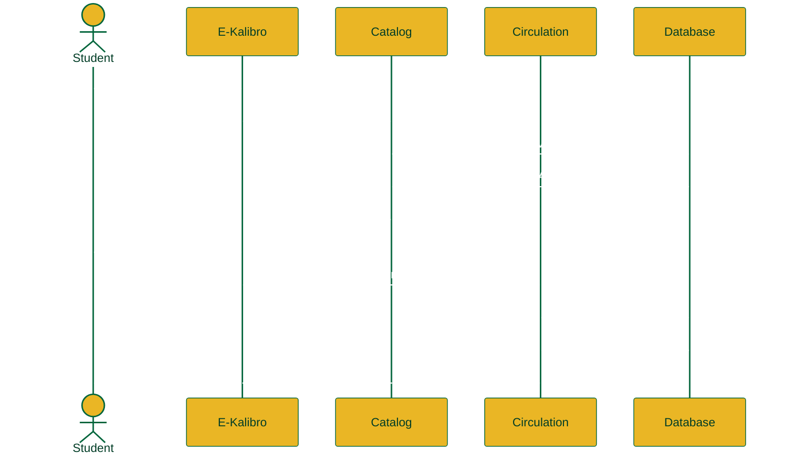

 

 

  

 

## 📑 Table of Contents

- [Who We Are](#-who-we-are)
- [About the Project](#-about-e-kalibro)
- [Core Features](#-core-features)
- [System Architecture](#-system-architecture)
- [Borrowing Workflow](#-borrowing-workflow)
- [Tech Stack](#-tech-stack)
- [Brand Palette](#-brand-palette)
- [Account Insights](#-account-insights)
- [Roadmap](#-roadmap)
- [Contributors](#-contributors)
- [License](#-license)

 

## 👋 Who We Are

This account is the **official home of E-Kalibro** — it doesn't host a portfolio of unrelated projects, it exists for one purpose: to build, document, and showcase our capstone case study for **Metro Dagupan Colleges**. Everything below — the code, the diagrams, the stats — belongs to this one project.

 

## 📖 About E-Kalibro

**E-Kalibro** is a web-based **Library Management System** developed as an academic case study for **Metro Dagupan Colleges (MDC)**. It reimagines the day-to-day work of running a campus library — cataloging titles, tracking who borrowed what and when it's due, and giving staff the visibility they need — as a fast, focused web app instead of a stack of logbooks and spreadsheets.

Built with **Svelte 4**, E-Kalibro is designed around three people: the **student** who just wants to find a book, the **librarian** who needs the circulation desk to move quickly, and the **administrator** who needs to see the collection from above.

| | |
|---|---|
| 🏫 **Institution** | Metro Dagupan Colleges |
| 🧩 **Domain** | Library Management System |
| 📁 **Project Type** | Capstone / Case Study |
| ⚙️ **Frontend** | Svelte 4 |
| 📌 **Status** | 🟢 Active Development |

 

## ✨ Core Features

<table>
<tr>
<td width="50%" valign="top">

### 📖 Catalog Management
Add, edit, and organize MDC's entire collection with rich, searchable metadata.

</td>
<td width="50%" valign="top">

### 🔄 Circulation Desk
Streamlined borrowing, returns, and renewals with real-time copy tracking.

</td>
</tr>
<tr>
<td width="50%" valign="top">

### 🔍 OPAC Search
A fast, student-facing catalog so anyone can find a title in seconds.

</td>
<td width="50%" valign="top">

### 🔔 Smart Notifications
Automated due-date reminders and overdue alerts for borrowers.

</td>
</tr>
<tr>
<td width="50%" valign="top">

### 🛂 Role-Based Access
Tailored views and permissions for students, faculty, librarians, and admins.

</td>
<td width="50%" valign="top">

### 📊 Analytics Dashboard
Borrowing trends and collection insights to support library decisions.

</td>
</tr>
</table>

 

## 🏛️ System Architecture

 

## 🔄 Borrowing Workflow

 

## 🛠️ Tech Stack

| Layer | Tools |
|---|---|
| **Frontend** | Svelte 4 · Vite · JavaScript (ES6+) · HTML5 · CSS3 |
| **Design** | Figma (UI/UX prototyping) |
| **Backend & Database** | _add your stack here — e.g. Node.js, Firebase, Supabase, or a REST API_ |
| **Tooling** | Git & GitHub · npm |

 

## 🎨 Brand Palette

Colors lifted directly from the E-Kalibro mark — MDC green and gold.

| Swatch | Name | Hex |
|---|---|---|
|  | MDC Green | `#04663D` |
|  | Deep Forest | `#013D26` |
|  | MDC Gold | `#EAB625` |
|  | Light Gold | `#F7D560` |
|  | Pure White | `#FFFFFF` |

 

## 📊 Account Insights

  

**Contribution activity**

Some org-level metrics may render sparsely until the account has more public activity — that's expected for a new case study repo.

 

## 🗺️ Roadmap

- [x] Requirements gathering & case study analysis
- [x] System design & ERD
- [x] UI/UX prototyping (Figma)
- [ ] Core catalog module
- [ ] Circulation (borrow / return) module
- [ ] Fines & notifications
- [ ] Admin analytics dashboard
- [ ] User acceptance testing with MDC Library staff
- [ ] Deployment

Update this checklist as the project moves forward — it reflects on the README the moment you edit it.

 

## 🤝 Contributors

  

This avatar grid pulls live from the repo's actual contributors — no manual upkeep needed as the team grows.

 

## 📄 License

Add a LICENSE file to the repo to have this badge reflect it automatically.

 

Made with 💚💛 for **Metro Dagupan Colleges**

[⬆ Back to top](#top)

